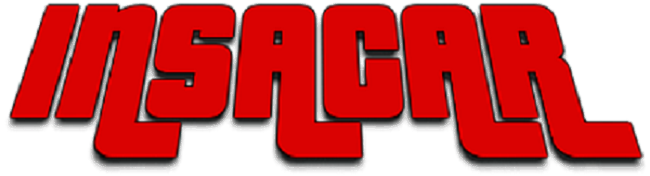

# InsaCar SelfDriving

Code source du projet de DeepQLearning 'InsacarSelfDriving'.

## Dépendances 

- FreePascal (testé sur 3.0.4)
- Binding SDL pour pascal (sdl, sdl_ttf, sdl_gfx) (DLL Windows dans /src/dependence)
- Python 3 (testé sur 3.8.2) & tensorflow (testé sur 2.2.0 rc2)

## Demo

## Build

    fpc /src/simulation/INSACAR_TYPES.pas
    fpc /src/simulation/tools.pas
    fpc /src/simulation/selfDrivingThread.pas
    fpc /src/simulation/selfDriving.pas
    fpc /src/simulation/config.pas
    fpc /src/simulation/main.pas 

## Faire jouer un modèle
Pour être seulement utilisateur d’un modèle, lancer ``play.py`` en ayant changé la variable `MODEL_PATH` suivant le modèle souhaité.

## Entrainement
Le réglage des hyperparamètres se situe dans le fichier ``agent.py``, celui des paramètres liés aux épisodes se situe dans le fichier ``main.py``.
On lance l'entrainement via ``main.py``.

## Tensorboard
Pendant l’entrainement, les logs sont stockés dans le dossier ``src/agent/logs``. 
Pour lancer le tensorboard :
- tensorboard –-logdir logs
- acceder à http://localhost:6006/

